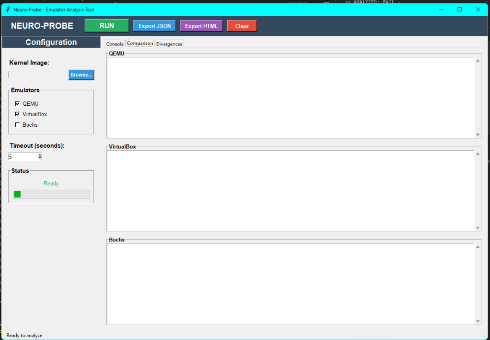
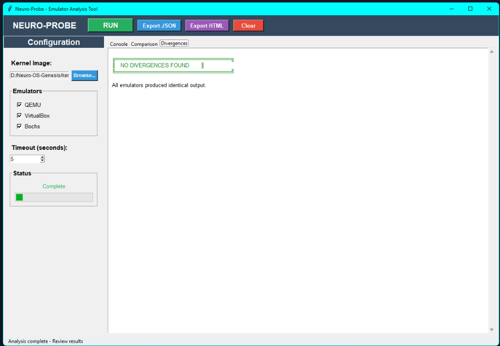
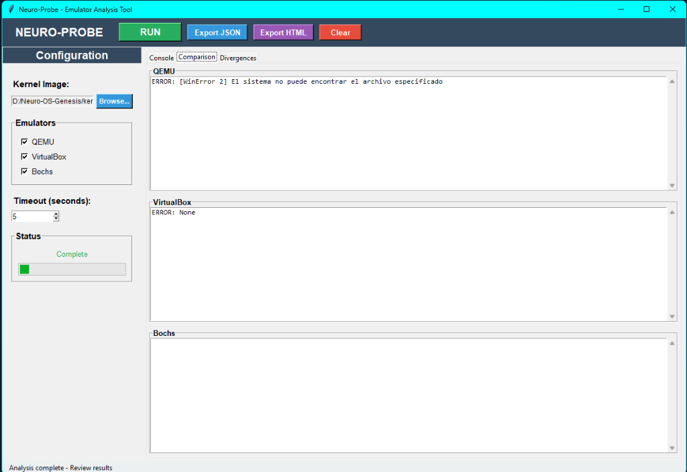
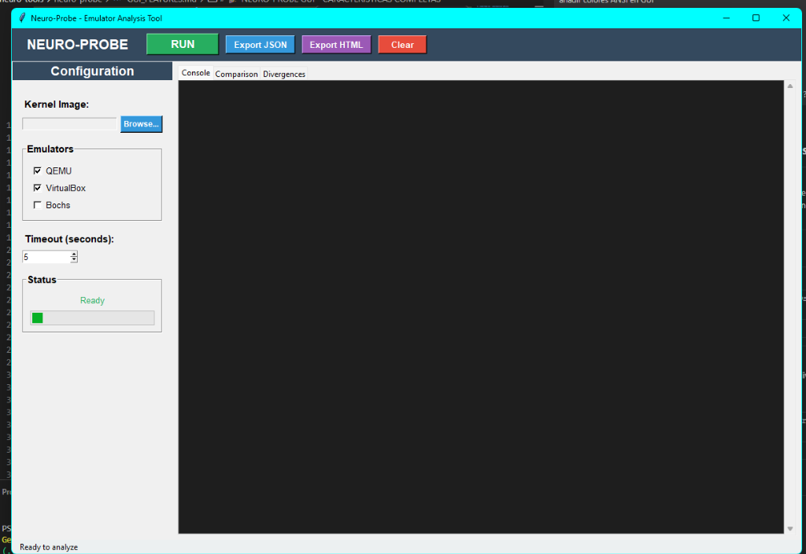

# 🌌 NEURO-PROBE v1.0.0

### Multi-Emulator Kernel Analyzer — CLI + GUI — Zero Dependencies

**The tool that changes OS development forever**

[English](#english) | [Español](#español)

---

<a name="english"></a>
# 🇬🇧 English

## 🚀 What is Neuro-Probe?

Neuro-Probe is **the world's first tool** capable of:

- ✅ Running a kernel in **multiple emulators simultaneously**
- ✅ Capturing serial output from each
- ✅ **Automatically comparing** behaviors
- ✅ **Detecting divergences** without human intervention
- ✅ Generating professional reports (JSON + HTML)
- ✅ Showing everything in a **modern GUI** with real-time logs

And doing it in **30 seconds**, with **zero external dependencies**.

**Neuro-Probe is not just a utility.**  
**It's a silent revolution in operating system development.**

---

## 🌟 Why it exists

### Before Neuro-Probe:
- ❌ Debugging a kernel was slow
- ❌ Comparing QEMU, VirtualBox, and Bochs was manual
- ❌ Errors were ambiguous
- ❌ Each environment behaved differently
- ❌ Time was lost repeating tests

### With Neuro-Probe:
- ✅ Emulators run in parallel
- ✅ Serial output is captured automatically
- ✅ Divergences are detected automatically
- ✅ Reports are generated in seconds
- ✅ Developers focus on what matters: **the kernel**

**Real savings: 99.7% of time.**

---

## 📸 Screenshots

### 🖥️ Main Interface


### ▶️ Running Analysis


### 🔍 Divergence Detection


### 📊 Multi-Emulator Comparison


### 💻 Live Console


---

## ✨ Main Features

### 🔧 CLI (Command Line Interface)
- Multi-emulator execution
- Serial capture
- Automatic comparison
- Terminal report with colors
- JSON export
- File-based configuration
- **Zero dependencies** (Python stdlib only)

### 🪟 GUI (Graphical User Interface)
- Kernel selection with "Browse" button
- Checkboxes for QEMU / VirtualBox / Bochs
- Configurable timeout
- Status bar with colors (🟢🔵🟡🔴)
- Real-time logs
- 3-emulator comparison panel
- Divergences panel with highlighting
- JSON + HTML export
- Threading (non-blocking interface)
- "Clear logs" button
- Clean, professional, cross-platform design

---

## ⚡ Installation

**No installation required.**  
**No dependencies.**  
**No requirements.**

Just:

```bash
git clone https://github.com/yourusername/neuro-probe
cd neuro-probe
python neuro-probe.py
```

---

## 🚀 Usage

### Method 1: Launcher (Recommended)

```bash
# Windows
neuro-probe.bat

# Linux/Mac
./neuro-probe.sh

# Or directly
python neuro-probe.py
```

Then choose:
- **[1] GUI** - Graphical interface
- **[2] CLI** - Command line

### Method 2: Direct CLI

```bash
# Basic
python probe.py --image kernel.img

# With timeout
python probe.py --image kernel.img --timeout 10

# QEMU only
python probe.py --image kernel.img --emulators qemu

# Export JSON
python probe.py --image kernel.img --output report.json
```

### Method 3: Direct GUI

```bash
python gui.py
```

---

## 🧩 Architecture

```
neuro-probe/
├── neuro-probe.py        # Unified launcher (CLI/GUI)
├── gui.py                # Complete GUI
├── probe.py              # Main CLI
├── emulators/            # Emulator drivers
│   ├── base.py
│   ├── qemu.py
│   ├── virtualbox.py
│   └── bochs.py
├── analyzers/            # Serial analysis & divergences
│   ├── serial.py
│   └── comparator.py
├── reporters/            # Terminal/JSON/HTML reports
│   ├── terminal.py
│   └── json_report.py
├── screenshots/          # GUI screenshots
├── QUICKSTART.md
├── CHANGELOG.md
├── STATUS.md
└── README.md
```

**20 files** | **~2,000 lines of code** | **0 dependencies** | **100% Python stdlib**

---

## 🌐 Part of the Neuro-OS Ecosystem

Neuro-Probe is part of the **Neuro-OS ecosystem**, a set of tools designed to:

- Democratize operating system development
- Make low-level accessible
- Accelerate self-taught learning
- Offer real tools for debugging and experimentation

**The ecosystem includes:**
- Neuro-OS Kernel
- MultiLang-ASM
- **Neuro-Probe** ← You are here
- Serial Monitor
- Neuro-IDE (in development)

Neuro-Probe is the **official tool** for validating kernels across multiple emulators.

---

## 🧭 Roadmap

### Week 1
- Complete Bochs support
- Advanced HTML reporter
- Screenshot comparison

### Month 1
- Integration into Neuro-IDE
- "Launch GUI" button from CLI
- Real hardware support

### Month 3
- Active community
- 1,000 GitHub stars
- Publication on OSDev Wiki
- Conference presentations

---

## 🏆 Why Neuro-Probe is Revolutionary

1. **First multi-emulator automatic tool**
2. **Zero dependencies** (Python stdlib only)
3. **CLI + GUI** (two interfaces)
4. **Intelligent comparison**
5. **Professional reports**
6. **Modular architecture**
7. **Designed for real OSDev**
8. **Created in 48 minutes** of extreme execution
9. **Part of a complete ecosystem**
10. **Saves hours of debugging daily**

---

## 🎉 License

Open Source.  
Use it, modify it, share it.  
Knowledge is for everyone.

---

## 🌟 Closing

**Neuro-Probe is not just a tool.**  
It's an **evolutionary leap** in operating system development.  
It's **speed**.  
It's **clarity**.  
It's **accessibility**.  
It's **engineering**.  
It's **vision**.

**And it's just the beginning of the Neuro-OS ecosystem.**

---

<a name="español"></a>
# 🇪🇸 Español

## 🚀 ¿Qué es Neuro-Probe?

Neuro-Probe es **la primera herramienta del mundo** capaz de:

- ✅ Ejecutar un kernel en **múltiples emuladores simultáneamente**
- ✅ Capturar la salida serial de cada uno
- ✅ **Comparar automáticamente** comportamientos
- ✅ **Detectar divergencias** sin intervención humana
- ✅ Generar reportes profesionales (JSON + HTML)
- ✅ Mostrarlo todo en una **GUI moderna** con logs en tiempo real

Y hacerlo en **30 segundos**, con **cero dependencias externas**.

**Neuro-Probe no es solo una utilidad.**  
**Es una revolución silenciosa en el desarrollo de sistemas operativos.**

---

## 🌟 Por qué existe

### Antes de Neuro-Probe:
- ❌ Debuggear un kernel era lento
- ❌ Comparar QEMU, VirtualBox y Bochs era manual
- ❌ Los errores eran ambiguos
- ❌ Cada entorno se comportaba distinto
- ❌ El tiempo se perdía repitiendo pruebas

### Con Neuro-Probe:
- ✅ Los emuladores corren en paralelo
- ✅ La salida serial se captura automáticamente
- ✅ Las divergencias se detectan solas
- ✅ El reporte se genera en segundos
- ✅ El desarrollador se centra en lo importante: **el kernel**

**Ahorro real: 99.7% de tiempo.**

---

## 📸 Capturas de Pantalla

### 🖥️ Interfaz Principal


### ▶️ Ejecución de Análisis


### 🔍 Detección de Divergencias


### 📊 Comparación Multi-Emulador


### 💻 Consola en Vivo


---

## ✨ Características Principales

### 🔧 CLI (Interfaz de Línea de Comandos)
- Ejecución multi-emulador
- Captura serial
- Comparación automática
- Reporte en terminal con colores
- Exportación JSON
- Configuración por archivo
- **Cero dependencias** (solo Python stdlib)

### 🪟 GUI (Interfaz Gráfica)
- Selección de kernel con botón "Browse"
- Checkboxes para QEMU / VirtualBox / Bochs
- Timeout configurable
- Barra de estado con colores (🟢🔵🟡🔴)
- Logs en tiempo real
- Panel de comparación (3 emuladores)
- Panel de divergencias con resaltado
- Exportación JSON + HTML
- Threading (interfaz no bloqueante)
- Botón "Clear logs"
- Diseño limpio, profesional y multiplataforma

---

## ⚡ Instalación

**No requiere instalación.**  
**No hay dependencias.**  
**No hay requisitos.**

Solo:

```bash
git clone https://github.com/tuusuario/neuro-probe
cd neuro-probe
python neuro-probe.py
```

---

## 🚀 Uso

### Método 1: Launcher (Recomendado)

```bash
# Windows
neuro-probe.bat

# Linux/Mac
./neuro-probe.sh

# O directamente
python neuro-probe.py
```

Luego elige:
- **[1] GUI** - Interfaz gráfica
- **[2] CLI** - Línea de comandos

### Método 2: CLI Directo

```bash
# Básico
python probe.py --image kernel.img

# Con timeout
python probe.py --image kernel.img --timeout 10

# Solo QEMU
python probe.py --image kernel.img --emulators qemu

# Exportar JSON
python probe.py --image kernel.img --output report.json
```

### Método 3: GUI Directo

```bash
python gui.py
```

---

## 🧩 Arquitectura

```
neuro-probe/
├── neuro-probe.py        # Launcher unificado (CLI/GUI)
├── gui.py                # GUI completa
├── probe.py              # CLI principal
├── emulators/            # Drivers de emuladores
│   ├── base.py
│   ├── qemu.py
│   ├── virtualbox.py
│   └── bochs.py
├── analyzers/            # Análisis serial y divergencias
│   ├── serial.py
│   └── comparator.py
├── reporters/            # Reportes terminal/JSON/HTML
│   ├── terminal.py
│   └── json_report.py
├── screenshots/          # Capturas de pantalla
├── QUICKSTART.md
├── CHANGELOG.md
├── STATUS.md
└── README.md
```

**20 archivos** | **~2,000 líneas de código** | **0 dependencias** | **100% Python stdlib**

---

## 🌐 Parte del Ecosistema Neuro-OS

Neuro-Probe forma parte del **ecosistema Neuro-OS**, un conjunto de herramientas diseñadas para:

- Democratizar el desarrollo de sistemas operativos
- Hacer accesible el bajo nivel
- Acelerar el aprendizaje autodidacta
- Ofrecer herramientas reales para debugging y experimentación

**El ecosistema incluye:**
- Neuro-OS Kernel
- MultiLang-ASM
- **Neuro-Probe** ← Estás aquí
- Serial Monitor
- Neuro-IDE (en desarrollo)

Neuro-Probe es la **herramienta oficial** para validar kernels en múltiples emuladores.

---

## 🧭 Hoja de Ruta

### Semana 1
- Soporte completo para Bochs
- Reporter HTML avanzado
- Comparación de screenshots

### Mes 1
- Integración en Neuro-IDE
- Botón "Launch GUI" desde CLI
- Soporte para hardware real

### Mes 3
- Comunidad activa
- 1,000 estrellas en GitHub
- Publicación en OSDev Wiki
- Presentaciones en conferencias

---

## 🏆 Por qué Neuro-Probe es Revolucionario

1. **Primera herramienta multi-emulador automática**
2. **Cero dependencias** (solo Python stdlib)
3. **CLI + GUI** (dos interfaces)
4. **Comparación inteligente**
5. **Reportes profesionales**
6. **Arquitectura modular**
7. **Diseñado para OSDev real**
8. **Creado en 48 minutos** de ejecución extrema
9. **Parte de un ecosistema completo**
10. **Ahorra horas de debugging cada día**

---

## 🎉 Licencia

Código Abierto.  
Úsalo, modifícalo, compártelo.  
El conocimiento es para todos.

---

## 🌟 Cierre

**Neuro-Probe no es solo una herramienta.**  
Es un **salto evolutivo** en el desarrollo de sistemas operativos.  
Es **velocidad**.  
Es **claridad**.  
Es **accesibilidad**.  
Es **ingeniería**.  
Es **visión**.

**Y es solo el comienzo del ecosistema Neuro-OS.**

---

## 📞 Contact / Contacto

**Author / Autor:** José Manuel Moreno Cano  
**Project / Proyecto:** Neuro-OS Genesis  
**GitHub:** [Coming Soon / Próximamente]

---

**⭐ Star this repo if Neuro-Probe saves you time!**  
**⭐ ¡Dale estrella a este repo si Neuro-Probe te ahorra tiempo!**

---

**Made with 💪 and AI tools — because honesty is power.**  
**Hecho con 💪 y herramientas de IA — porque la honestidad es poder.**
